Example: Setting up Active Directory Federation Services (ADFS) to use with Jenkins
----------------

*Note:* replace adfs.example.com with the name of your ADFS, replace jenkins.example.com with the name of your Jenkins host.

**On the Jenkins side:**
Download the IdP file to paste into the Jenkins config from your ADFS. It is generally exposed under the following URL:

```
https://adfs.example.com/FederationMetadata/2007-06/FederationMetadata.xml
```

**On the Windows side:**

Open the Management console (mmc), make sure you have the AD FS Management snap-in. Add a Relying Party Trust:

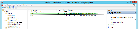

Go through the wizard. The properties at the end should look like indicated on the following screens.

**Monitoring:** unmodified | **Identifiers:** The relying party identifier is: http://jenkins.example.org/securityRealm/finishLogin
------------ | -------------
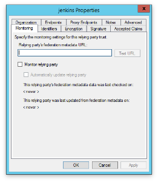 | 

**Encryption:** import key from the JENKIS_HOME/saml-sp.metadata.xml file | **Signature:** import key from the JENKIS_HOME/saml-sp.metadata.xml file
------------ | -------------
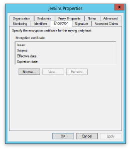 | 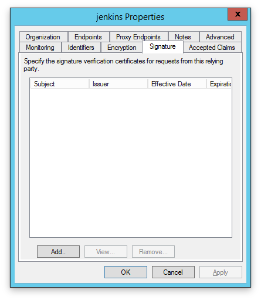

**Accepted Claims:** unmodified | **Organization:** unmodified
------------ | -------------
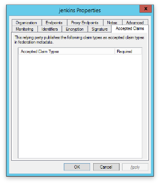 | 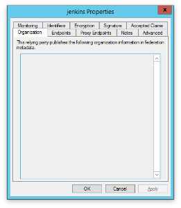

**Endpoints:** URL is http://jenkins.example.org/securityRealm/finishLogin, binding POST | **Proxy Endpoints:** unmodified
------------ | -------------
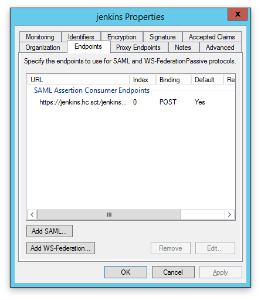 | 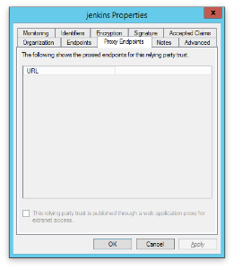

**Notes:** unmodfied | **Advanced:** SHA-256
------------ | -------------
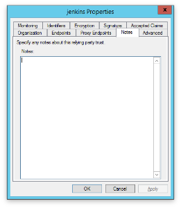 | 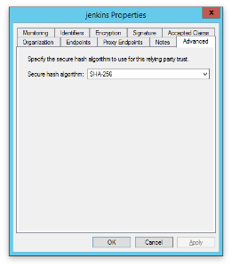

Select the Relying Party Trust and click on Edit Claim Rules.... You should expose the following LDAP attributes:| 
------------ | -------------
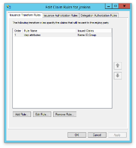 | 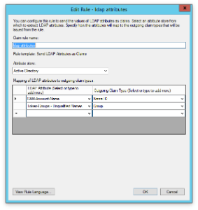

Allow all users to connect, or modify depending on your setup:| 
------------ | -------------
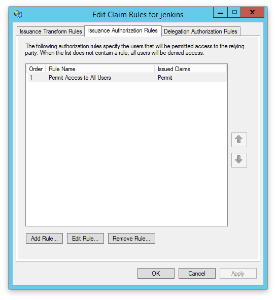 | 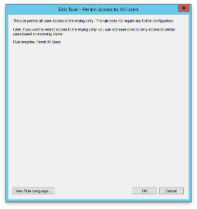

**Delegation Authorization Rules:** unmodified	 

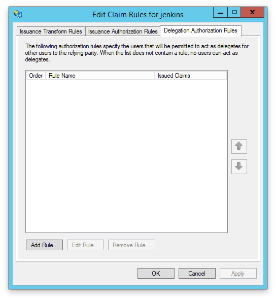


 