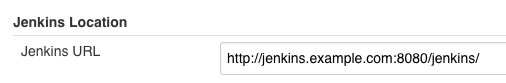

## Configure Azure

You have to configure a SSO application on Azure by following the instructions in [Configuring single sign-on to applications that are not in the Azure Active Directory application gallery](https://docs.microsoft.com/en-us/azure/active-directory/active-directory-saas-custom-apps). You will have to take care of the following settings in order to configure Jenkins SAML Plugin properly:

* **Sign On URL**: it should be the Jenkins base URL Manage, you have to check the value of Jenkins URL setting on `Jenkins/Configure System/Jenkins Location/Jenkins URL`

* **Identifier**: the identifier that you want to use as Entry ID for Jenkins SP (e.g. `JenkinsSP`).
* **Reply URL**: The URL when the SAMLResponse will be sent, it should be like this one `https://<JENKINS_URL>/securityRealm/finishLogin`
* **Sign-Out URL**: The URL that you want to use to log-out from your SSO, this will be appear in the IdP Metadata XML like this example
```
    <SingleLogoutService Binding="urn:oasis:names:tc:SAML:2.0:bindings:HTTP-Redirect" Location="https://login.microsoftonline.com/common/saml2"/>)
```
* **SAML XML Metadata URL**: the URL that return the IdP metadata XML, it should looks like `https://login.microsoftonline.com/<TenantDomainName>/FederationMetadata/2007-06/FederationMetadata.xml` see [Federation metadata](https://docs.microsoft.com/en-us/azure/active-directory/develop/active-directory-federation-metadata) for more details.
* **Binding Protocol**: Azure exposed HTTP-Redirect and HTTP-POST you have to select the Binding protocol, SAML Plugin Latest version support HTTP-Redirect and HTTP-POST
```
    <SingleSignOnService Binding="urn:oasis:names:tc:SAML:2.0:bindings:HTTP-Redirect" Location="https://login.microsoftonline.com/common/saml2"/>
    <SingleSignOnService Binding="urn:oasis:names:tc:SAML:2.0:bindings:HTTP-POST" Location="https://login.microsoftonline.com/common/saml2"/>
```

You should customize Attibutes to send to Jenkins [Customizing claims issued in the SAML token for enterprise applications in Azure Active Directory](https://docs.microsoft.com/en-us/azure/active-directory/develop/active-directory-saml-claims-customization), these are the recommended attributes to setup:
* **User Name**: attribute will be load with the unique user ID (e.g. name=`username` value=`user.userprincipalname`).
* **Display Name**: attribute will be load with the user name to display in the UI (e.g. name=`displayname` value=`user.givenname`).
* **Groups**: attribute will be load with the groups assigned to the user (e.g. name=`groups` value=`user.memberof`).
* **Email**: attribute will be load with the user email address (e.g. name=`email` value=`user.mail`).

For more detail about Azure configuration take a look at the SAML 2.0 Azure documentation:

[How Azure Active Directory uses the SAML protocol](https://docs.microsoft.com/en-us/azure/active-directory/develop/active-directory-saml-protocol-reference)

[Single Sign-On SAML protocol](https://docs.microsoft.com/en-us/azure/active-directory/develop/active-directory-single-sign-on-protocol-reference)

## Configure Jenkins

These are the recomended configuration settings to make Jenkins SAML Plugin work with Azure SSO service.

* **Metadata**
  * **IdP Metadata**: The IdP Metadata XML downloaded from Azure (e.g. `https://login.microsoftonline.com/<TenantDomainName>/FederationMetadata/2007-06/FederationMetadata.xml`) see [Federation metadata](https://docs.microsoft.com/en-us/azure/active-directory/develop/active-directory-federation-metadata) for more details (not need if you have set the IdP Metadata URL).
  * **IdP Metadata URL**: The URL to download the IdP Metadata XML (e.g. `https://login.microsoftonline.com/<TenantDomainName>/FederationMetadata/2007-06/FederationMetadata.xml`) see [Federation metadata](https://docs.microsoft.com/en-us/azure/active-directory/develop/active-directory-federation-metadata) for more details (not need if you have set the IdP Metadata).
    * **Refresh Period**: The period of minutes we will wait until refresh the IdP Metadata. Set it to 0 to not update the metadata.
* **Display Name Attribute**: the attribute name that contains the **Display Name** of the user you have set in Azure configuration (e.g. `displayname`).
* **Group Attribute**: the attribute name that contains the **Groups** of the user you have set in Azure configuration (e.g. `groups`).
* **Username Attribute**: the attribute name that contains the **User Name** of the user you have set in Azure configuration (e.g. `username`).
* **Email Attribute**: the attribute name that contains the **Email** of the user you have set in Azure configuration (e.g. `email`).
* **Data Binding Method**: method of redirection binding HTTP-Redirect and HTTP-POST you have set as **Binding Protocol** on Azure configuration.
* **Logout URL**: the URL you have set as **Sign-Out URL** on Azure configuration.
* **Advanced Configuration**
  * **Force Authentication**: if you experience problems with the authentication it is recommended to enable it.
  * **SP Entity ID** - value you have set as **Identifier** in the Azure configuration (e.g. `JenkinsSP`).
  
For more details about the SAML Plugin configuration take a look at [Configuration Guide](CONFIGURE.md)
